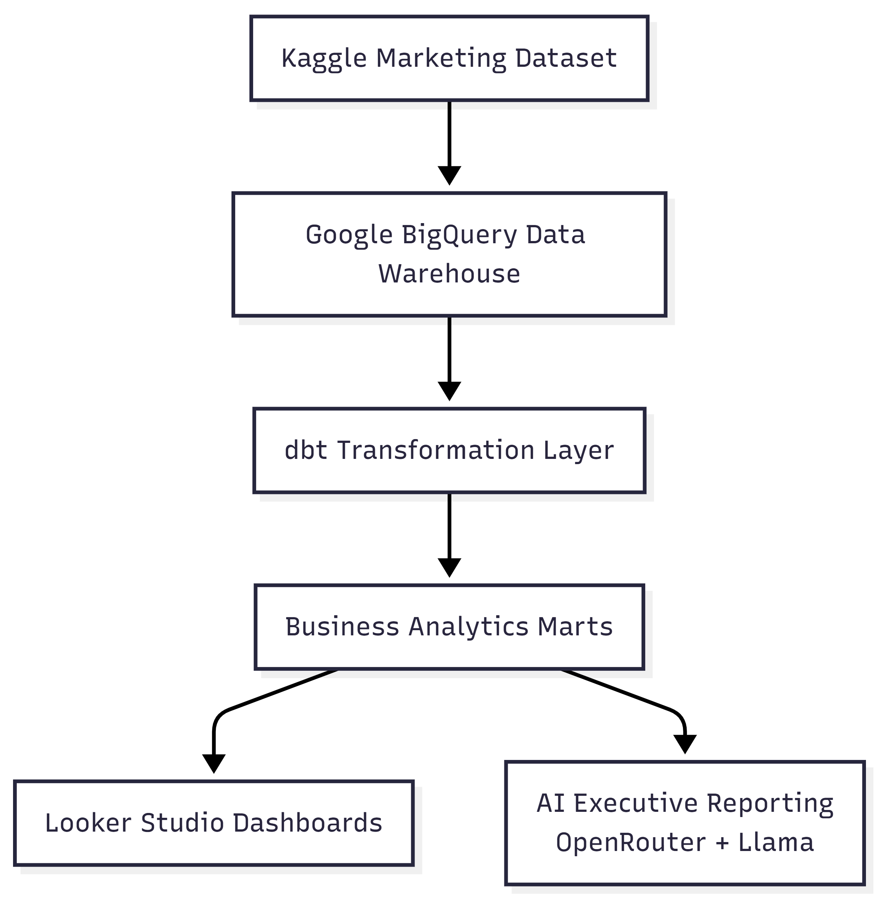
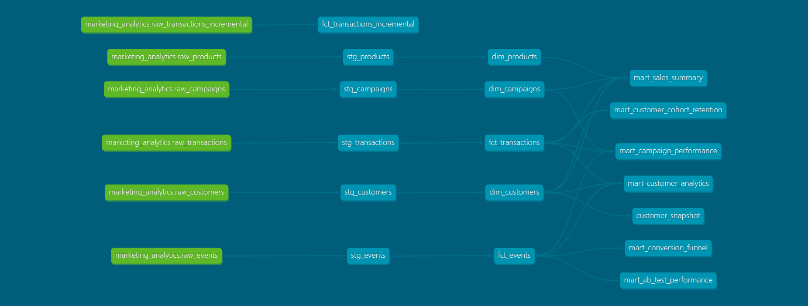
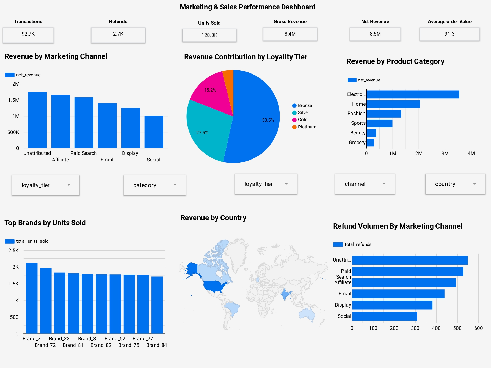
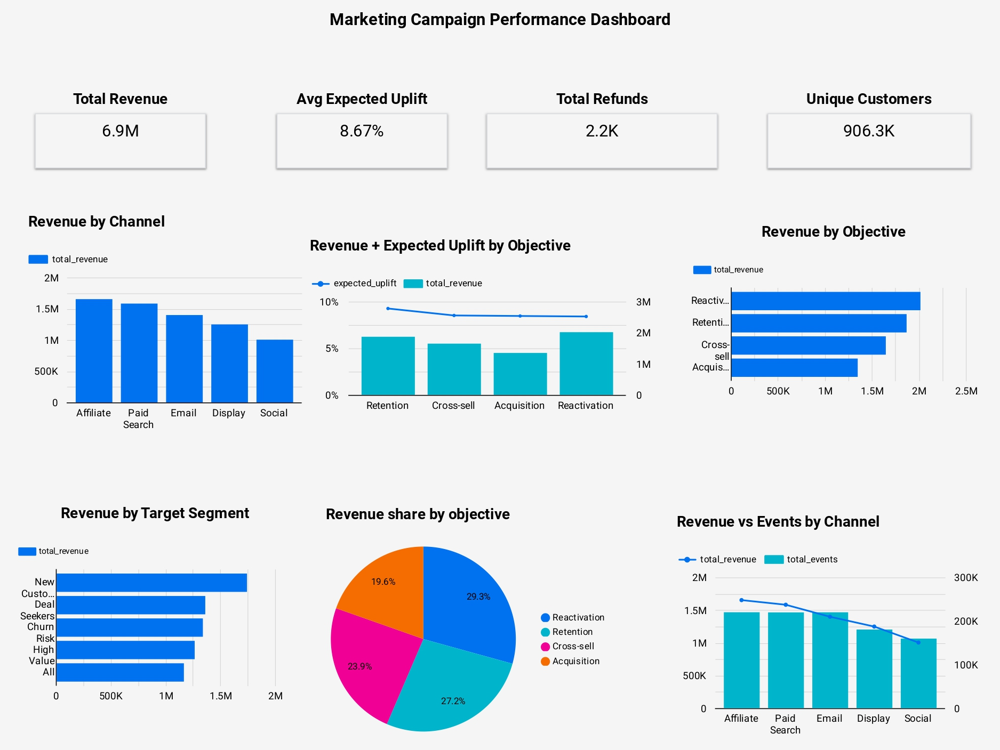
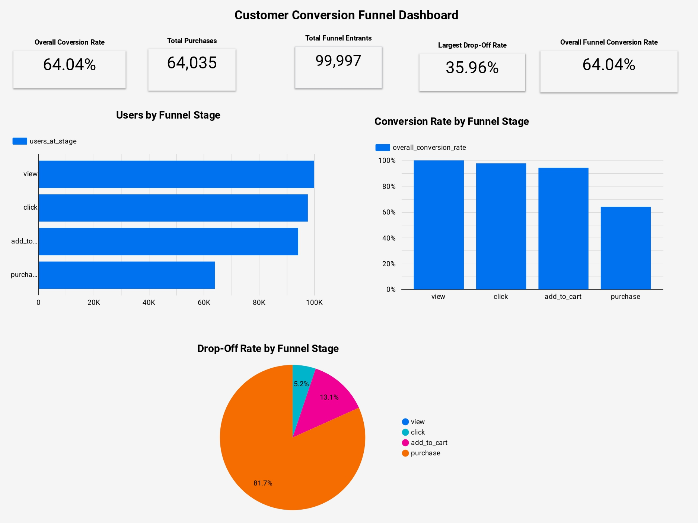
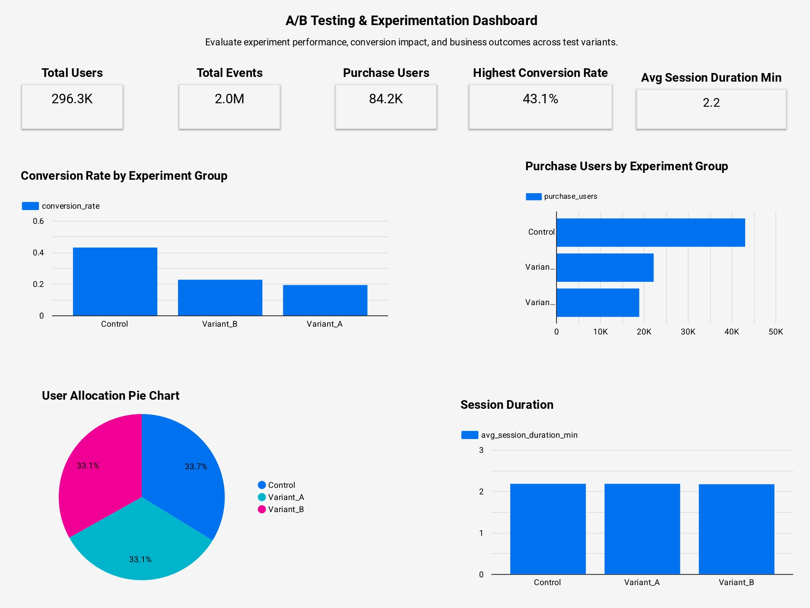

# Marketing Analytics Platform

## Overview

The Marketing Analytics Platform is an end-to-end Analytics Engineering project built using Google BigQuery, dbt, Python, and AI-powered reporting.

The project transforms raw marketing, customer, campaign, product, and transaction data into trusted business-ready datasets that support reporting, experimentation analysis, customer analytics, and executive decision-making.

The platform demonstrates modern Analytics Engineering practices including:

- Data Warehousing with Google BigQuery
- Dimensional Modeling using Star Schema principles
- dbt Transformations and Modular Data Modeling
- Incremental Data Processing
- Historical Tracking with dbt Snapshots
- Automated Data Quality Validation using dbt Tests
- Business Intelligence and Reporting
- AI-Powered Executive Insight Generation

---

## Business Problem

Marketing and business teams often struggle to answer important questions because data is fragmented across multiple sources and lacks a governed analytics layer.

This platform was designed to answer questions such as:

* Which campaigns generate the highest revenue?
* Which marketing channels perform best?
* Where do customers drop off in the conversion funnel?
* Which customer segments are most valuable?
* How effective are A/B test variations?
* How can analytical pipelines scale efficiently as data volume grows?

---

## Architecture



### High-Level Data Flow

```text
Raw Marketing Data
        │
        ▼
Google BigQuery
        │
        ▼
dbt Transformation Layer
 ├── Staging Models
 ├── Dimension Models
 ├── Fact Models
 ├── Incremental Models
 └── Snapshots
        │
        ▼
Business Analytics Marts
        │
 ┌──────┴──────────────┐
 │                     │
 ▼                     ▼

Dashboards      AI Executive Reporting
```

---

## Technology Stack

| Layer                  | Technology             |
| ---------------------- | ---------------------- |
| Data Warehouse         | Google BigQuery        |
| Analytics Engineering  | dbt                    |
| Data Modeling          | Star Schema            |
| Data Quality           | dbt Tests              |
| Historical Tracking    | dbt Snapshots          |
| Incremental Processing | dbt Incremental Models |
| Programming            | Python                 |
| Dashboarding           | Looker Studio          |
| AI Reporting           | OpenRouter + Llama     |
| Version Control        | Git & GitHub           |

---

## Data Model

### Dimensions

* dim_customers
* dim_products
* dim_campaigns

### Facts

* fct_transactions
* fct_events

### Advanced Models

* fct_transactions_incremental
* customer_snapshot

---

## dbt Lineage

The lineage graph below demonstrates how source tables flow through staging, dimensions, facts, snapshots, and business marts.



---

## Analytics Engineering Implementation

### Staging Models

Raw source data is standardized and cleaned through dedicated staging models.

* stg_transactions
* stg_customers
* stg_products
* stg_campaigns
* stg_events

### Dimension Models

Business entities are modeled using dimension tables.

* dim_customers
* dim_products
* dim_campaigns

### Fact Models

Business events are modeled using fact tables.

* fct_transactions
* fct_events

### Business Marts

The platform provides business-ready marts for reporting and analytics.

* mart_sales_summary
* mart_campaign_performance
* mart_customer_analytics
* mart_conversion_funnel
* mart_ab_test_performance
* mart_customer_cohort_retention

---

## Incremental Processing

A dedicated incremental model was implemented to process only newly arrived transaction data rather than rebuilding the full dataset.

### Benefits

* Faster execution
* Reduced BigQuery processing costs
* Improved scalability
* Production-oriented architecture

### Example

```sql
{{ config(
    materialized='incremental',
    unique_key='transaction_id'
) }}

SELECT *
FROM {{ source('marketing_analytics', 'raw_transactions_incremental') }}



WHERE timestamp >
(
    SELECT MAX(timestamp)
    FROM {{ this }}
)


```

---

## Historical Snapshots

A dbt snapshot was implemented to preserve historical customer state.

Snapshot:

```text
customer_snapshot
```

This enables:

* Historical customer analysis
* Change tracking
* Slowly Changing Dimension (SCD Type 2) style reporting

### Snapshot Example

```sql


{{
config(
    unique_key='customer_id',
    strategy='check',
    check_cols='all'
)
}}

SELECT *
FROM {{ ref('dim_customers') }}


```

---

## Data Quality & Governance

Automated data quality checks were implemented using dbt tests.

### Implemented Tests

* not_null
* unique
* accepted_values
* relationships

These tests help ensure data reliability and analytical trustworthiness.

---

## Dashboard Examples

### Sales Performance Dashboard



### Campaign Performance Dashboard



### Conversion Funnel Dashboard



### A/B Test Dashboard



## AI Executive Reporting

An AI reporting layer was built using Python and OpenRouter.

The workflow:

1. Query business marts from BigQuery
2. Aggregate business KPIs
3. Build structured business context
4. Send context to an LLM
5. Generate executive-level business insights

Generated reports include:

* Executive Summary
* Sales Performance Analysis
* Marketing Analysis
* Funnel Analysis
* Experiment Evaluation
* Strategic Recommendations
* Risks & Opportunities

The generated report is available at `ai/executive_report.md`.

### Example Executive Summary

- Total revenue: $8,630,269.31
- Total transactions: 92,678
- Top marketing channel: Affiliate
- Best A/B test variant: Control

[View the full executive report](ai/executive_report.md)

This demonstrates how traditional analytics platforms can be enhanced using Generative AI.

---

## Repository Structure

```text
marketing-analytics-platform/

marketing-analytics-platform/

├── README.md
├── requirements.txt
├── .gitignore

├── ai/
│   ├── generate_insights.py
│   └── executive_report.md

├── analysis/
│   └── ab_test_analysis.py

├── credentials/
│   ├── .gitkeep
│   └── README.md

├── dashboards/
│   ├── sales_dashboard.jpg
│   ├── market_campaign.jpg
│   ├── flow.png
│   └── ab_testing.jpg

├── data/
├── dbt/
├── docs/
└── python/

---

## How to Run

### Install Dependencies

```bash
pip install -r requirements.txt
```

### Configure Credentials

Place your Google Cloud service account file in:

```text
credentials/service-account.json
```

### Execute dbt

```bash
cd dbt

dbt deps
dbt run
dbt test
dbt snapshot
```

### Generate Documentation

```bash
dbt docs generate
dbt docs serve
```

---

## Business Impact

The platform enables stakeholders to:

* Monitor revenue performance
* Analyze customer behavior
* Evaluate marketing effectiveness
* Track conversion funnels
* Measure A/B test performance
* Understand customer retention
* Automate executive reporting

By centralizing business logic within BigQuery and dbt, the platform improves consistency, reduces manual reporting effort, and accelerates decision-making.

---

## Key Learnings

This project demonstrates practical experience with:

* Analytics Engineering
* Data Warehousing
* Dimensional Modeling
* Incremental Data Processing
* Historical Snapshots
* Data Quality Testing
* Business Intelligence
* AI-Augmented Analytics
* End-to-End Data Platform Design

---

## Future Enhancements

Potential future improvements include:

* Real-time streaming ingestion
* Workflow orchestration with Airflow
* Marketing attribution modeling
* Customer lifetime value prediction
* Forecasting and predictive analytics
* Natural language analytics assistant

```
